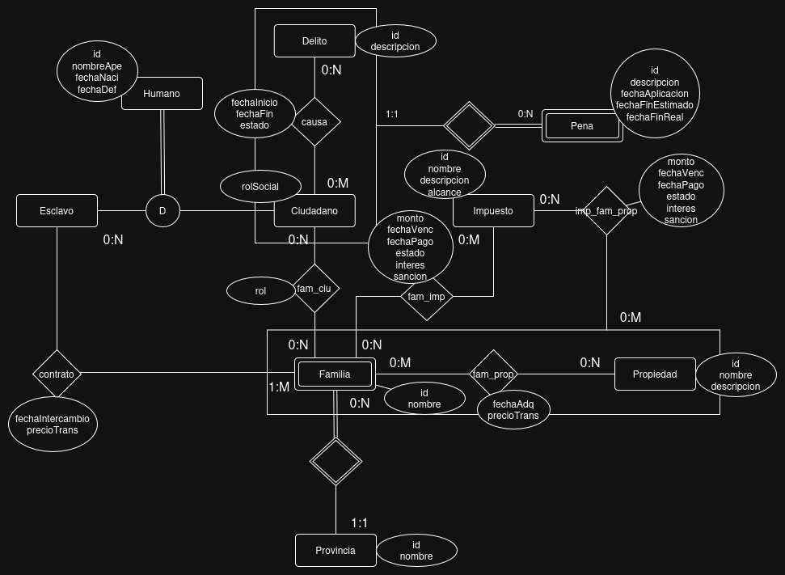

# Gestion del Imperio Romano
## Integrantes
- 52533- Giusti, Santiago
- 45210- Sandoval, Ezequiel
- 52646- Faraone, Samuel

## Repositorios
- [front-end](https://www.youtube.com/watch?v=4Jt78n_A7jM)
- [back-end](https://www.youtube.com/shorts/7DOExArb7Fc)

## Descripcion
Es un sistema basado en el Imperio Romano que cumple 3 funciones principales: 
- Hacer un censo, tanto de Hombres libres (sin discriminar ciudadano de artensano y demas trabajadores manuales) como asi tambien de esclavos.
- Gestionar el pago de impuestos, separandolos en impuestos a la propiedad e impuestos a las familias.
- Y por ultimo, un sistema de gestion judicial, donde se va a registrar todo antecedente criminal, solo para hombres libres.

## Modelo

## Casos de Uso para la REGULARIDAD
| Requerimiento | Detalle/Listado de casos incluidos |
| --- | --- |
| ABMC Simple | Provincia   Propiedad   Humano |
| ABMC Dependiente | Familia   Impuesto |
| CU NO-ABMC | CU_registrar_ciudadano |
| Listado Simple | Listado de miembros de una familia.   Listado de impuestos a pagar para una familia.   Listado de impuestos a pagar para una familia. |
| Listado Complejo | - |

## Casos de Uso para la AP DIRECTA
| Requerimiento                | Detalle/Listado de casos incluidos                                                                            |
| ---------------------------- | ------------------------------------------------------------------------------------------------------------- |
| CU "Complejo"(nivel resumen) |                            |
| Listado complejo             |                            |
| Nivel de acceso              |                            |
| Manejo de errores            |                            |
| Publicar el sitio            |                            |

### Requerimientos extra - AD
| Requerimiento | Detalle/Listado de casos incluidos |
| --- | --- |
|  |  |
